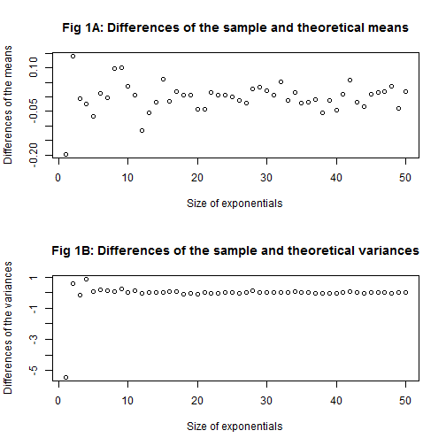

## Motivation
My Shiny application is motivated by [the Coursera's Statistical Inference class project](https://github.com/cobu2b/statinference-project/blob/master/partI.pdf). The class assignment generates sample popultion based on average of 40 exponentials; however, the size of the exponentials is fixed. This application allows us to explore an effect of the size of exponentials.

## Introduction
The application allows us to adjust the size of the samples used for calculating their mean in order to represent sample population. We can compare sample and theoretical means and variances of the exponential distribution based on the different sizes. Central Limit Theorem can be used to explain the distributions.

## Research Question
What is an effect of the sample and theoretical means and variances of the exponential distribution based on the different sizes of exponentials?

--- .class #id

## Central Limit Theorem (CLT)
The [central limit theorem](http://www.math.uah.edu/stat/sample/CLT.html) states that the distribution of the sum (or average) of a large number of independent, identically distributed variables will be approximately normal, regardless of the underlying distribution.

## Simulation
The Shiny application generates 1,000 means of the given size of exponentials assigned by the slider input for representing sample population. This simulation can help us understand how CLT works in action.


```r
  means <- reactive({
    set.seed(952)
    means <- NULL
    for (i in 1 : simulations) {
      means = c(means, mean(rexp(input$exps, lambda)))
    }
    means
  })
```

--- .class #id

## Experiment
This experiment performs differences of the sample and theoretical means and variances of the exponential distribution based on the different sizes of exponentials from 1 to 50.



--- .class #id

## Summary
When the size of exponentials increases, the distribution will be closer to the normal distribution. Having larger size of exponentials will make the sample mean be closer to the population mean, so it will help the sample variance be closer to the population variance and the normal distribution.

Fig 1A and 1B show that the differences of the sample and theoretical means and variances are close to 0 when the size of exponentials increases. The Shiny application helps us visualize the experiment clearly. These allow us understand how CLT works in action.

